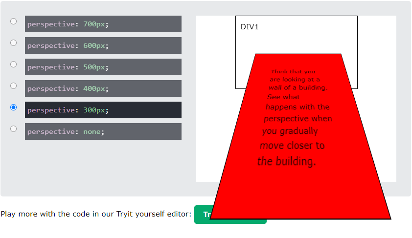
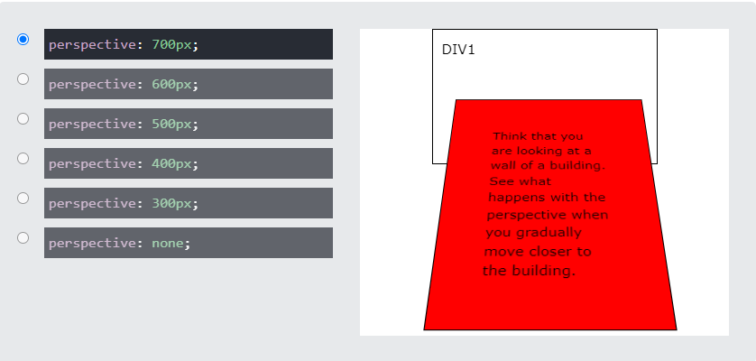

# Rotating-Image-Gallery


## 기능
버튼 클릭시 이미지가 버튼의 방향대로 움직이는 갤러리 

<br>

## 참고 
https://picsum.photos/  
더미 이미지 불러와서 사용

<br>

## 학습
### 1. css : transform-style  
요소의 하위 항목이 3D 공간 에 배치되는지 아니면 요소 평면에서 평면화되는지 여부를 설정

|속성|의미|
|---|---|
|flat|요소의 하위 항목이 요소 자체의 평면에 있음|
|preserve-3d|요소의 하위 항목이 3D 공간에 배치|

### 2. css : perspective  
: 3D 위치의 요소에 원근감을 제공하는 데 사용  
: perspective개체가 사용자로부터 얼마나 멀리 떨어져 있는지를 정의합니다. 따라서 값이 낮을수록 값이 클수록 3D 효과가 더 강해집니다.   

**perspective : 300px 일때**


**perspective : 700px 일때**


<br>  

### 3. css : rotateX, rotateY

|속성|의미|
|---|---|
|rotateX| 가로를 축으로 하여 회전   
|rotateY| 세로를 축으로 하여 회전  


### 4. css : css 변수   

**CSS 변수 선언 및 호출**      
: CSS에서 <u>변수의 이름을 지정할 때는 변수 맨 앞에 --</u> 를 붙여주어야 한다. 그리고 <u>변수를 호출해 사용할 때는 var(변수명)형식</u>을 사용한다.
```
:root {
	--main-font-color: #000f22;  /* CSS 전역 변수 선언 */
}

div {
	color: var(--main-font-color);   /* CSS 변수 사용 */
}
```


<br>

## 학습 출처
**유튜브**   
https://www.youtube.com/@JavaScriptKing

**css**  
https://developer.mozilla.org/   
https://www.w3schools.com/

**css : css 변수**  
https://inpa.tistory.com/entry/CSS-%F0%9F%93%9A-CSS%EC%9A%A9-%EB%B3%80%EC%88%98-variable-%EC%A0%95%EB%A6%AC